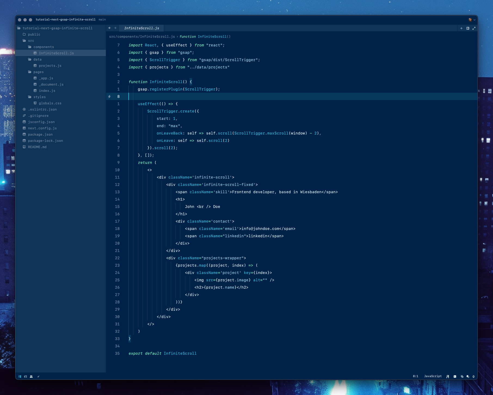

<h3 align="center">
	Replicant for <a href="https://zed.dev/">Zed</a>
</h3>




<!-- ## Usage
1. Create the theme folder if it doesn't already exist:
	```bash
	mkdir -p ~/.config/zed/themes/
	```
2. Execute the command to download the theme:
   ```bash
   curl -o ~/.config/zed/themes/replicant.json https://raw.githubusercontent.com/pierrenel/replicant/main/replicant.json
   ```

3. Open Zed
4. Open the command palette
5. Open the theme selector and search for Replicant
6. Enjoy 🚀
 -->

&nbsp;
## 🚀 Created by

🧑🏼‍💻 [Pierre Nel](https://github.com/pierrenel) based on [Replicant for VSCode](https://github.com/kenziebottoms/vscode-theme-replicant) by Kenzie Bottoms

&nbsp;

## 🚀 Follow me
[X](https://twitter.com/pierre_nel)
&nbsp;
[LinkedIn](http://uk.linkedin.com/in/pierrenel)
&nbsp;
[Portfolio](https://pierre.io)

&nbsp;


<p align="center">

</p>
